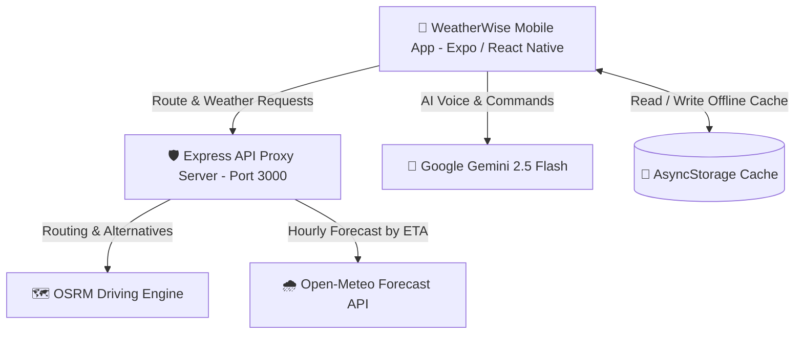

# WeatherWise

[](https://github.com/bagalmarclester/WeatherWise/actions/workflows/ci.yml)
[](https://expo.dev)
[](https://reactnative.dev)
[](https://www.typescriptlang.org/)
[](https://ai.google.dev/)

> **WeatherWise** is an intelligent, spatiotemporal weather-aware navigation and routing mobile application. It predicts hazardous weather conditions along your exact driving trajectory by synchronizing your estimated time of arrival (ETA) at each waypoint with hourly meteorological forecasts.

---

## Features

- **Spatiotemporal Route Sampling**: Samples route coordinates at regular time intervals (e.g., every 20 minutes) using Haversine distance calculations to accurately determine future arrival locations.
- **Precision Weather Forecasting**: Integrates with [Open-Meteo](https://open-meteo.com/) to fetch hourly precipitation probabilities, weather codes, and hazard severity tailored to the exact ETA of each waypoint.
- **Gemini AI Voice Assistant**: Powered by Google's **Gemini 2.5 Flash**, providing conversational voice commands, hands-free query support, and trip weather summaries.
- **Alternative Route Comparison**: Evaluates multiple driving paths from OSRM and visually displays risk levels (clear, moderate, high risk) with color-coded polyline segments.
- **Offline Caching & Resilience**: Local caching powered by `@react-native-async-storage/async-storage` ensures instant route reload and offline resilience.
- **API Proxy Server**: Express-based proxy middleware (`server/proxy.js`) handling rate limiting, request forwarding, and caching for Nominatim, OSRM, and weather APIs.
- **Automated CI/CD Workflows**: Full GitHub Actions pipeline for automated TypeScript validation, unit test execution, and Android APK compilation.

---

## System Architecture



---

## Getting Started

### Prerequisites

Ensure you have the following installed on your machine:
- [Node.js](https://nodejs.org/) (v20.x or higher recommended)
- [npm](https://www.npmjs.com/) (v10.x or higher)
- [Expo CLI](https://docs.expo.dev/get-started/installation/)
- [Android Studio](https://developer.android.com/studio) or a physical Android/iOS device with **Expo Go**

---

### Installation

1. **Clone the repository:**
   ```bash
   git clone https://github.com/bagalmarclester/WeatherWise.git
   cd WeatherWise
   ```

2. **Install dependencies:**
   ```bash
   npm install
   ```

3. **Configure Environment Variables:**
   Copy the example environment file and add your Google Gemini API Key:
   ```bash
   cp .env.example .env
   ```
   Edit `.env`:
   ```env
   EXPO_PUBLIC_GEMINI_API_KEY=your_google_gemini_api_key_here
   ```

---

## Running the Application

### 1. Start the API Proxy Server
The proxy server handles request routing and CORS for map and weather data:
```bash
npm run proxy
```
*Proxy runs by default on `http://localhost:3000`.*

### 2. Start the Expo Development Server
In a separate terminal window:
```bash
npm start
```

### 3. Launch on Target Platform
- **Android Emulator / Device**: Press `a` in the Expo terminal or run `npm run android`
- **iOS Simulator**: Press `i` in the Expo terminal or run `npm run ios`
- **Web Preview**: Press `w` in the Expo terminal or run `npm run web`

---

## Testing & Validation

WeatherWise includes an automated logic test suite covering waypoint sampling, ETA distribution, and AI SDK integration:

```bash
# Run TypeScript Type Checker
npm run type-check

# Run Automated Logic Test Suite
npm test
```

---

## Available Scripts

| Command | Description |
| :--- | :--- |
| `npm start` | Starts the Expo Metro development bundler |
| `npm run android` | Builds and runs the native Android app |
| `npm run ios` | Builds and runs the native iOS app |
| `npm run web` | Launches the web preview bundler |
| `npm run proxy` | Starts the local Express API proxy server (`server/proxy.js`) |
| `npm run type-check` | Runs `tsc --noEmit` across all TypeScript files |
| `npm test` | Runs the core automated test suite with `tsx` |

---

## CI/CD Pipelines

This repository is configured with **GitHub Actions** for continuous integration and delivery:

1. **[CI Pipeline](.github/workflows/ci.yml)**:
   - Triggers on every `push` and `pull_request` to `master` and `main`.
   - Executes TypeScript type checks (`tsc --noEmit`), automated test suites, and validates Android build compilation (`./gradlew assembleDebug`).

2. **[Android CD & Release](.github/workflows/android-release.yml)**:
   - Can be triggered manually via `workflow_dispatch` or automatically on version tags (`v*`).
   - Generates standalone Android APK artifacts and attaches them to GitHub Releases.

3. **[Expo EAS Build](.github/workflows/eas-build.yml)**:
   - Allows on-demand cloud builds via Expo Application Services (EAS).

---

## Author

- **Bagalmarclester** ([@bagalmarclester](https://github.com/bagalmarclester))
- Repository: [https://github.com/bagalmarclester/WeatherWise](https://github.com/bagalmarclester/WeatherWise)
